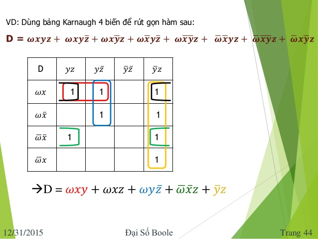

# PHẦN 1: Thiết lập bảng chân trị


### Dùng thuật toán Queen - McCluskey

## Dữ kiện:

    Cho một file input.txt chứa duy nhất một biểu thức đại số bool (không khoảng trắng
    giữa các kí tự). Các biến trong biểu thức là 26 chữ cái in hoa trong bảng chữ cái tiếng
    Anh, các phép toán bao gồm Phủ định (~), Hay (+), Và ( . <bị lược bỏ>)

## Yêu cầu:

Viết chương trình và xuất ra file output.txt:
(1) Dòng đầu tiên là tất cả các tiền đề nguyên tố của biểu thức đại số bool (Prime Implicants)
(2) Các dòng tiếp theo lần lược liệt kê các công thức đa thức tối tiểu.

## Ví dụ:

| input.txt                 | output.txt          |
| :------------------------ | :------------------ |
| XYZ+~X~Z+XY~Z+~X~YZ+~XY~Z | ~X~Y, ~X~Z, Y~Z, XY |
|                           | ~X~Y+~X~Z+XY        |
|                           | ~X~Y+Y~Z+XY         |

## Ý tưởng giải quyết bài toán

Xét tập hợp các hàm Bool của n biến Fn theo n biến x1 , x2 ,…,xn

- Mỗi hàm bool xi hay được gọi là từ đơn.
- Đơn thức là tích khác không của một số hữu hạn từ đơn.
- Từ tối tiểu là tích khác không của đúng n từ đơn.
- Công thức đa thức là công thức biểu diễn hàm Bool thành tổng của các đơn thức.
- Dạng nối rời chính tắc là công thức biểu diễn hàm Bool thành tổng của các từ tối tiểu.

### Bước 1: Tiền xử lý biểu thức boolean và tìm các từ tối tiểu

    Qui ước:
        + Khẳng định : 1
        + Phủ định: 0
        + Biên không xuất hiện: 2

Ví dụ:

| Từ đơn | Qua tiền xử lý |
| :----- | :------------- |
| XYZ    | 111            |
| X~YZ   | 101            |
| Y~Z    | 210            |
| ~XYZ   | 011            |
| ~X~YZ  | 001            |
| ~Y     | 202            |


### Bước 2: Sử dụng biểu đồ Knaugh thông qua thuật toán Queen - McCluskey để tìm tất cả các tế bào lớn

Gồm các bước (sau khi đã tìm được tất cả các từ tối tiểu):
- B1. Gom nhóm các từ tối tiểu theo số lượng bit 1 trong biểu diễn số. Giả sử ta có (n+1)
nhóm, tương ứng với số bit 1 từ 0 đến n.
- B2. Ghép lần lượt các phần tử ở nhóm thứ i với các phần tử ở nhóm thứ i+1:
    - ▶ Nếu 2 phần tử chỉ khác nhau duy nhất 1 bit thì ghép được với nhau, và ta ghi vào
cột kết quả (thay vị trí bit khác nhau này bằng số 2).
    - ▶ Ngược lại, nếu một phần tử ở nhóm i không ghép được với bất kỳ phần tử nào của
nhóm (i+1) hoặc (i-1) thì được đánh dấu *.
- B3. Xét cột kết quả, tiếp tục ghép các giá trị khác nhau trong cột kết quả. Lặp lại đến khi
cột kết quả rỗng.

Khi kết thúc thuật toán, các giá trị có dấu * là những tế bào lớn (TBL) cần tìm.

Ví dụ:



## Bước 3: Ghi kết quả

Thiết lập fuction tìm tất cả các chỉnh hợp chập k 
(với 0 < k < size(variables)) để tìm ra tất cả các tập con của list tế bào lớn. 
Sau đó, áp dụng thuật toán đã xây dựng ở bước 2 với từng tập con 
để kiểm tra xem tập con có thỏa là công thức tối tiểu của biểu thức boolean 


## Sử dụng:

```bash
git clone https://github.com/mandydinh/discrete-mathematic.git
cd lab02
cat input.txt # đổi biểu thức logic đầu vào ở đây
g++ boolean.cpp -o run # compile file
./run # execute file


cat output.txt ## xem kết quả bảng chân trị qua file .txt
```
## Coding Journey

| Day        | Duration   | Describe Stuck or A done feature     |Cause or Result       |
|------------|------------|--------------------------------------|----------------------|
| so long... | ...        | Finish the core requirement          | The old version  |
| 27/12/2019 | ...        | Push to Github and write README (translate English) | not yet  |
| ../12/2019 | ... hours  | .....                  | ....   |
